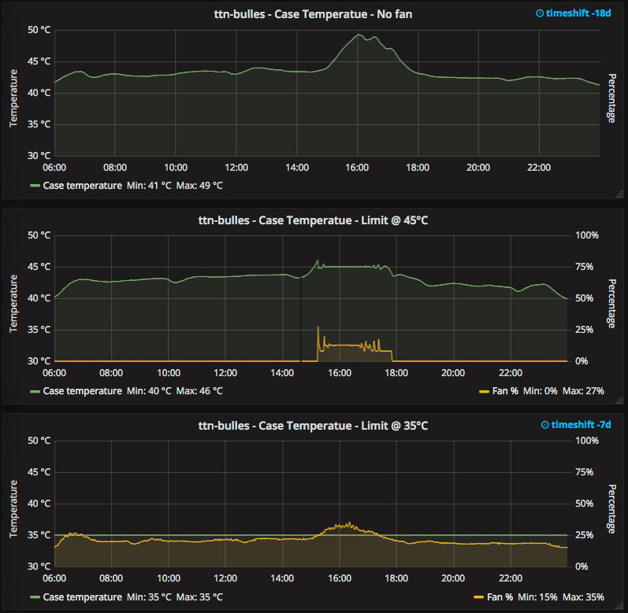

# TTN Fan
Simple python script to control temperature on a Raspberry Pi / IC880A DIY [The Things Network](https://www.thethingsnetwork.org/) Gateway using [dbrgn's  backplane](https://github.com/dbrgn/ic880a-backplane).  
It uses a [PID controller](http://en.wikipedia.org/wiki/PID_controller) to drive the fan.

Temperature and fan percentage are logged in InfluxDB.

The script can easily be adapted for other hardware configurations. However you should avoid to use the processor temperature as reference as its low resolution won't lead to a stable PID loop.

The following picture shows the temperature of an indoor gateway
- without fan;
- target set at 45°C (fan only runs when temperature exceeds threshold);
- target set at 35°C (fan always runs)



More information about this gateway configuration is available on [Youmagine](https://www.youmagine.com/designs/enclosure-for-dyi-lorawan-gateway-for-the-things-network).

## Prerequisites
1. Hardware:
  - Gateway installed (including the backplane sensors)
  - 5V fan connected to the backplane
1. Software: install required python modules (python virtualenv is always a good idea):  
`pip install -r requirements.txt`

## Getting started
Review the default values in `ttn-fan.py`, in particular the connection details to InfluxDB (unless you have a different hardware setup the other values should not be changed)

Start the script as root:
- `sudo ttn-fan.py -v` (default target temperature)
- `sudo venv/bin/python ttn-fan.py -v` (virtualenv example)
- `sudo ttn-fan.py -v --target-temp=40.0` (specify target temperature)

__Note__: By default `ttn-fan` uses the `sht21` linux kernel driver. However there are [some issues](http://www.advamation.com/knowhow/raspberrypi/rpi-i2c-bug.html) with the Raspberry Pi...  
If the kernel driver does not work for you, you can either apply [this kernel patch](https://www.mail-archive.com/linux-hwmon@vger.kernel.org/msg03187.html) to you kernel, or use the `sht21` user-mode driver provided by adding the `--user-mode` option. E.g.:
```shell
sudo venv/bin/python ttn-fan.py -v --user-mode
```
The downside of the user-mode driver is that it does not allow concurrent access.
As workaround, you can specify a lock file shared by concurrent applications. E.g.:
```shell
sudo venv/bin/python ttn-fan.py -v --user-mode --lock-file /var/run/lock/sht21.lock
```


## Setting up ttn-fan as a service
When everything is configured, you can start ttn-fan as a service!  
Use the provided service template -- e.g.:
```
cp ttn-fan.service /etc/systemd/system/
systemctl daemon-reload
systemctl enable ttn-fan
systemctl start ttn-fan
systemctl status ttn-fan
```
(select the appropriate `ExecStart` command in the service file)

## Note about InfluxDB
To avoid failures when the database is not reachable we use the UDP protocol. Ensure that UDP is enabled on your InfluxDB server, or amend `ttn-fan.py` to use the TCP protocol.
